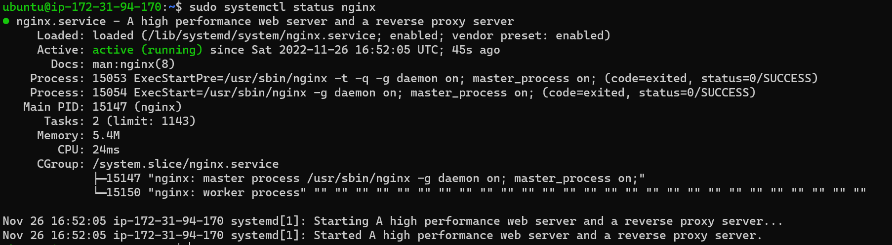
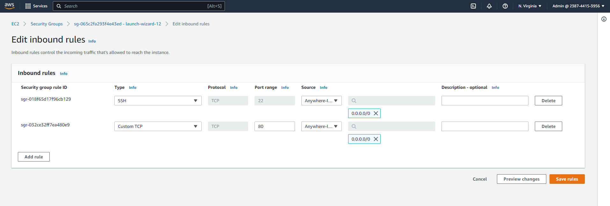
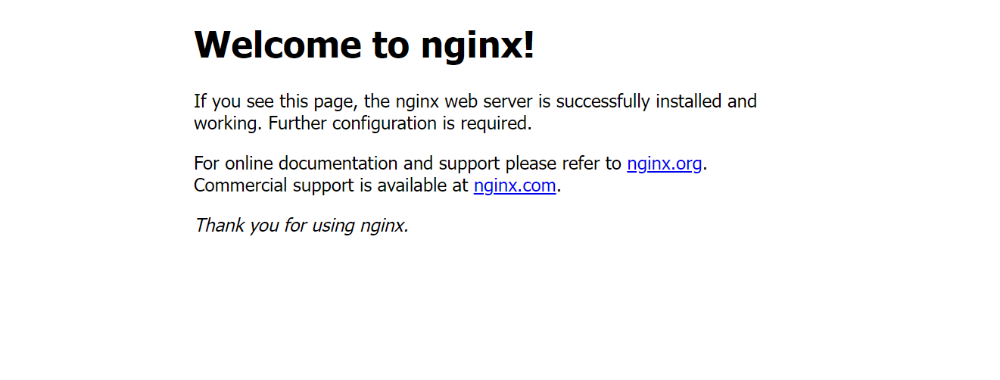
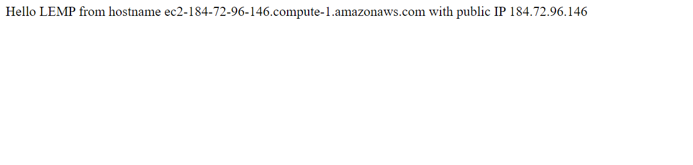
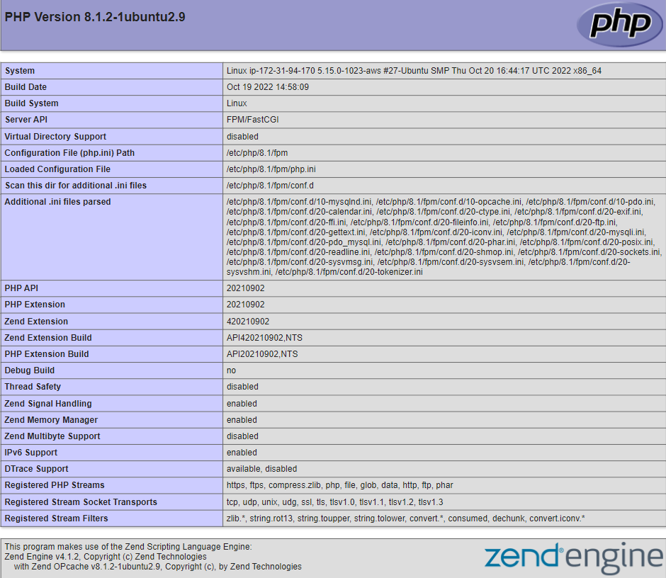
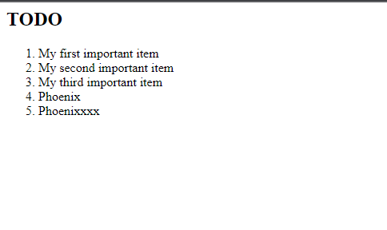

# MERN Stack on Ubuntu 22.04 

The MERN stack is an acronym for MongoDB, Express, React / Redux, and Node.js. The MERN stack is one of the most popular JavaScript stacks for building modern single-page web applications (SPA).

### Prerequisites
1. An Ubuntu VM (In this tutorial we're using an Ubuntu 22.04 on AWS EC2 instance.

This tutorial is broadly divided into 6 categories


1. Installing the Nginx web server
2. Installing MYSQL
3. Installing PHP
4. Confiquring Nginx to use PHP processor
5. Testing PHP with Nginx
6. Retrieving data from MYSQL database with PHP
   
   
   ## Installing the Nginx web Server

To display web pages, we are going to implore Nginx, a high-performance web server

Update ubuntu

`$sudo apt update`

Upgrade ubuntu

`$sudo apt upgrade`

Install Nginx

`$sudo apt install -y nginx`

To verify that Nginx has been installed and is running as a service in Ubuntu run:

`$sudo systemctl status nginx`

**If it is green and running, you have launched a web server in the clouds! Yay!** :purple_heart: :confetti_ball: :fireworks:

 
 


To allow traffic from port 80, which is the default port for most web applications

>We need to edit inbound firewall rule and allow traffic on TCP port 80 on our EC2 instance. TCP port 22 is open by default.





**Our server is running and we can access it from any IP Address and locally**

lets try to access it locally from our ubuntu shell by running:

`$curl http://localhost:80`

```html
{
Output:
<!DOCTYPE html>
<html>
<head>
<title>Welcome to nginx!</title>
<style>
    body {
        width: 35em;
        margin: 0 auto;
        font-family: Tahoma, Verdana, Arial, sans-serif;
    }
</style>
</head>
<body>
<h1>Welcome to nginx!</h1>
<p>If you see this page, the nginx web server is successfully installed and
working. Further configuration is required.</p>

<p>For online documentation and support please refer to
<a href="http://nginx.org/">nginx.org</a>.<br/>
Commercial support is available at
<a href="http://nginx.com/">nginx.com</a>.</p>

<p><em>Thank you for using nginx.</em></p>
</body>
</html>

```
 Secondly, lets test how our server responds to the request from the internet. run:

`http://<Public-Ip-Address>:80`





**If you see the page above, then our webserver was successful installed and accessible through our firewall. Double Yay!!✨✨**

---


## Installing MYSQL

Now that our web server is up and running, we need to install a *database management system <b>DBMS<b>*--MYSQL in this case.

`$sudo apt install -y mysql-server`

Login to the MYSQL console:

`$ sudo mysql`

```
Output:

Welcome to the MySQL monitor.  Commands end with ; or \g.
Your MySQL connection id is 8
Server version: 8.0.31-0ubuntu0.22.04.1 (Ubuntu)

Copyright (c) 2000, 2022, Oracle and/or its affiliates.

Oracle is a registered trademark of Oracle Corporation and/or its
affiliates. Other names may be trademarks of their respective
owners.

Type 'help;' or '\h' for help. Type '\c' to clear the current input statement.

mysql>

```

>It’s recommended that you run a security script that comes pre-installed with MySQL. This script will remove some insecure default settings and lock down access to your database system. Before running the script, you will set a password for the root user, using mysql_native_password as default authentication method.run:

`ALTER USER 'root'@'localhost' IDENTIFIED WITH mysql_native_password BY '<password>'`
   
Exit mysql shell with:

`exit`

Start the interactive script by running:

`$ sudo mysql_secure_installation`
   
>This will ask if you want to configure the **Validate password plugin**
Enabling this feature is something of a judgment call. 
Answer Y for yes, or anything else to continue without enabling.

Let's check if we are able to login to the MYSQL console:
   
`$ sudo mysql -p`

To exit
   
`mysql> exit`
   
>Notice that you need to provide a password to connect as the root user. For increased security, it’s best to have dedicated user accounts with less expansive privileges set up for every database, especially if you plan on having multiple databases hosted on your server.

**Our MySQL server is now installed and secured. Next, we will install PHP, the final component in the LEMP stack...Awesome** :clap:

---
   

##  Installing PHP

We have Nginx installed to serve our content and MySQL to store and manage  our data. We need to install PHP to process code and generate dynamic content for our web server. While Apache embeds the PHP interpreter in each request, Nginx requires an external program to handle PHP processing and act as a bridge between the PHP interpreter itself and the web server. This allows for a better overall performance in most PHP-based websites, but it requires additional configuration.

We need to install **php-fpm**, which stands for *“PHP fastCGI process manager”*, and tell Nginx to pass PHP requests to this software. Additionally, we need **php-mysql**, a PHP module that allows PHP to communicate with MySQL-based databases. *Core PHP packages will automatically be installed as dependencies.* Run;

`$ sudo apt install php-fpm php-mysql`

**PHP components have now been installed!:boom: Let's move to step 4** :boom: :boom:

---


## Confiquring Nginx to use PHP processor

On Ubuntu 22.04, Nginx has one server block enabled by default and is configured to serve documents out of a directory at */var/www/html*. While this works well for a single site, it can become difficult to manage if we are hosting multiple sites. We’ll create a directory structure within */var/www* for our domain website, leaving */var/www/html* in place as the default directory to be served if a client request does not match any other sites.

Create the root web directory:

`$ sudo mkdir /var/www/projectLEMP`

Next, assign ownership of the directory with the $USER environment variable, which will reference our current system user:

`$ sudo chown -R $USER:$USER /var/www/projectLEMP`

Now let,s open a new configuration file in Nginx’s sites-available directory 

`$ sudo nano /etc/nginx/sites-available/projectLEMP`

Paste in the following bare-bones configuration:

```
server{
        listen 80;
        server_name projectLEMP www.projectLEMP;
        root /var/www/projectLEMP;

        index index.html index.htm index.php;

        location / {
        try_files $uri $uri/ =404;
        }

        location ~ \.php$ {
        include snippets/fastcgi-php.conf;
        fastcgi_pass unix:/var/run/php/php8.1-fpm.sock;
        }

        location ~ /\.ht {
        deny all;
        }

```

Save and close the file. If you’re using nano, you can do so by typing **CTRL+X** and then **y** and **ENTER** to confirm.

Activate the configuration by linking to the config file from Nginx’s sites-enabled directory:

`$ sudo ln -s /etc/nginx/sites-available/projectLEMP /etc/nginx/sites-enabled/`

To test for syntax error, run;
	
`$ sudo nginx -t`

```
Output:

nginx: the configuration file /etc/nginx/nginx.conf syntax is ok
nginx: configuration file /etc/nginx/nginx.conf test is successful

```

We also need to disable default Nginx host that is currently configured to listen on port 80, for this run:

`$ sudo unlink /etc/nginx/sites-enabled/default`

Reload Nginx to apply the changes:

`$ sudo systemctl reload nginx`

Our website is now active :exclamation:, but the web root /var/www/projectLEMP is still empty.Create an index.html file in that location so that we can test that our new server block works as expected:

```
$ sudo echo 'Hello LEMP from hostname' $(curl -s http://169.254.169.254/latest/meta-data/public-hostname) 'with public IP' $(curl -s http://169.254.169.254/latest/meta-data/public-ipv4) > /var/www/projectLEMP/index.html

```

Now let" go to browser and try to open our website URL using the instanace public IP address:

`$ http://<Public-IP-Address>:80`
	
You should see somthing like this:
	
	

	
	
**Lemp Stack is now configured!**

---
## Testing PHP with Nginx

We need to validate that Nginx can correctly hand .php files off to your PHP processor.

To do this, we'll create a test PHP file in the document root.

`$ sudo nano /var/www/projectLEMP/info.php`

Paste this in:

```
<?php
phpinfo();

```
We can now access the web browser using the domain name or public IP address we’ve set up in our Nginx configuration file, followed by /info.php:

`http://<server_domain_or_IP>./info.php`





After checking the relevant information about our PHP server, it’s best to remove the file you created as it contains sensitive information about your PHP environment and your Ubuntu server. You can use rm to remove that file:

`$ sudo rm /var/www/your_domain/info.php`

---


## Retrieving data from MYSQL database with PHP

In this step we will create a test database (DB) with simple "To do list" and configure access to it, so the Nginx website would be able to query data from the DB and display it.

First, connect to the MySQL console using the root account:

`$ sudo mysql`

To create a new database, run the following command from your MySQL console:

```
$mysql> CREATE DATABASE `example_database`;
```

The following command creates a new user named example_user, using mysql_native_password as default authentication method.

Define the user's password

`mysql> CREATE USER 'example_user'@'%' IDENTIFIED WITH mysql_native_password BY 'password';`

Now we need to give this user permission over the example_database database:

`mysql> GRANT ALL ON example_database.* TO 'example_user'@'%';`

>This will give the example_user user full privileges over the example_database database, while preventing this user from creating or modifying other databases on our server.

Now exit the MySQL shell with:

`$ mysql> exit`

You can test if the new user has the proper permissions by logging in to the MySQL console again, this time using the custom user credentials:

`mysql -u example_user -p`

After logging in to the MySQL console, confirm that you have access to the database:

`mysql> SHOW DATABASES;`

This will give you the following output:

```
Output

Welcome to the MySQL monitor.  Commands end with ; or \g.
Your MySQL connection id is 19
Server version: 8.0.31-0ubuntu0.22.04.1 (Ubuntu)

Copyright (c) 2000, 2022, Oracle and/or its affiliates.

Oracle is a registered trademark of Oracle Corporation and/or its
affiliates. Other names may be trademarks of their respective
owners.

Type 'help;' or '\h' for help. Type '\c' to clear the current input statement.

mysql>  SHOW DATABASES;
+--------------------+
| Database           |
+--------------------+
| example_database   |
| information_schema |
| performance_schema |
+--------------------+
3 rows in set (0.00 sec)

mysql>

```

Next, we’ll create a test table named todo_list. From the MySQL console, run the following statement:

```
CREATE TABLE example_database.todo_list (
mysql> 	item_id INT AUTO_INCREMENT,
mysql> 	content VARCHAR(255),
mysql> 	PRIMARY KEY(item_id)
mysql> );

```

Insert a few rows of content in the test table. You might want to repeat the next command a few times, using different VALUES:

`mysql> INSERT INTO example_database.todo_list (content) VALUES ("<xxxxx>");`

To confirm that the data was successfully saved to your table, run:

`mysql> SELECT * FROM example_database.todo_list;`

You’ll see the following output:


After confirming that you have valid data in your test table, you can exit the MySQL console:

`mysql> exit`

Now you can create a PHP script that will connect to MySQL and query for your content. Create a new PHP file in your custom web root directory.

`nano /var/www/projectLEMP/todo_list.php`

The following PHP script connects to the MySQL database and queries for the content of the todo_list table, displays the results in a list. 

Paste this in todo_list.php script:

```

?php
$user = "example_user";
$password = "password";
$database = "example_database";
$table = "todo_list";
 
try {
  $db = new PDO("mysql:host=localhost;dbname=$database", $user, $password);
  echo "<h2>TODO</h2><ol>";
  foreach($db->query("SELECT content FROM $table") as $row) {
	echo "<li>" . $row['content'] . "</li>";
  }
  echo "</ol>";
} catch (PDOException $e) {
	print "Error!: " . $e->getMessage() . "<br/>";
	die();
}

```

Save and close the file when you are done editing.

**Almost done!**

Now, let's go and access it in out web browser

`http://<Public_domain_or_IP>/todo_list.php`

You should see a page like this, showing the content you’ve inserted in your test table:





That means our PHP environment is ready to connect and interact with your MySQL server. :tada: :tada: :tada:


